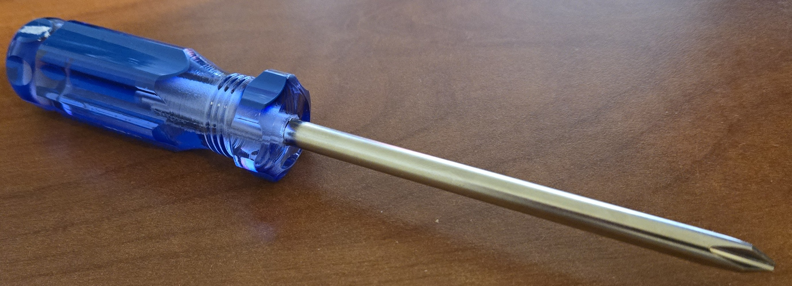
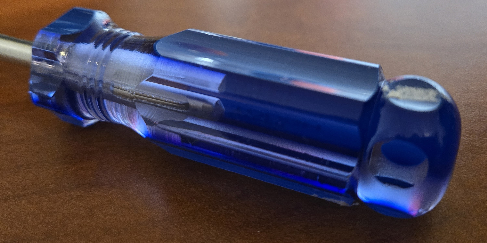
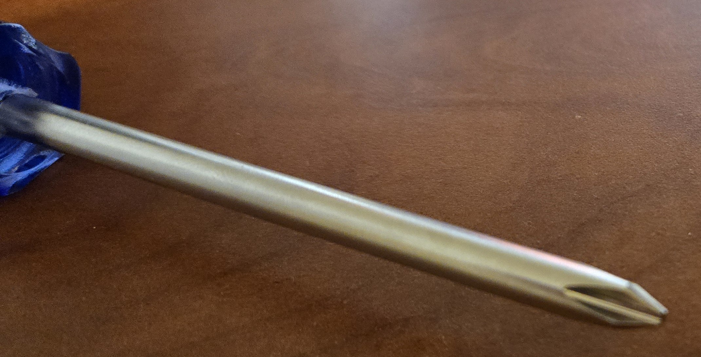

# A1 – Professional Portfolio

## Decide

### Homepage Identity

### Intentional Customization

### Documentation Standard

## Objective

## Analyze

### Task A - Portfolio Analysis

#### Portfolio 1 - Retvin Pant

[View Retvin Pant's Portfolio](https://ret101.github.io/Retvin-Pant-Portfolio/)

**Navigability:** The portfolio is easy to navigate, with a consistent theme and layout. All projects and included information were on pages accessible from the home page within a clickstream of three or less, resulting in a practical and efficient user journey no matter the topic of interest that remained under a sixty second search time.

**Reproducibility:** All projects available for viewing were categorized into four subsections: Industry experience, Baja SAE, Team Projects, and Personal Projects. The types of information provided for each project varied depending on the subsection. If programming was required for a project the code would be integrated within the corresponding project page and all designed parts were rendered and integrated into the corresponding project page through Fusion 360. The dimensions for all developed parts were accessible through Fusion 360 but information regarding materials and the fabrication processes were lacking in depth and detail preventing exact replication.

**Evidence of Reasoning:** Most of the projects included general information regarding the design process and decision-making scheme. The average depth and detail of this information varied between the four project subcategories with the Industrial Experience projects containing the most specific information and the Personal Projects containing the least specific information. The Industrial Experience Projects contained subsections regarding contributions, design constraints, design decisions and reasoning, notes regarding failures or predicted modes of failure with corresponding solutions, and an analysis of results. The provided evidence of reasoning was sufficient in demonstrating the individual’s consideration of constraints, failure prevention, problem solving, and reasoning for design decisions.

**Professional Tone:** The tone and language used throughout the portfolio was sufficient to meet the expectations of work colleagues and close superiors while remaining casual enough to remain affable and inviting. Technical terminology was used throughout the descriptions of each project with enough depth and detail to convey design and developmental information with little ambiguity. 

#### Portfolio 2 - Allister James Sequeira

[View Allister James Sequeira's Portfolio](https://allisterjsequeira.github.io/rbh.html)

**Navigability:** The portfolio was streamlined with straightforward structuring. The first page to appear when accessing the website was the projects page, and the general information for each project and the corresponding final reports were accessible within a clickstream of three or less leading to a streamlined user journey for each project that was consistently under a search time of sixty seconds. 

**Reproducibility:** While the general information provided on each project page was not sufficient for a colleague to replicate the corresponding project, each project page contained a link to the corresponding final report which included part dimensions, design decisions based on constraints and regulations, FEA testing and results, component lists, manufacturing and fabrication methods for various parts, and diagrams. While the project descriptions within the portfolio may be lacking in the details necessary for reproduction, the inclusion of the project reports provides a near excessive amount of information that a well-informed reader can use for understanding and reproduction.

**Evidence of Reasoning:** The provided general description of each project lacked the depth and detail required to comprehend the individual’s decision-making framework and reasoning and focused primarily on the overall themes and results. However, the project reports linked within said general descriptions contained sufficient depth and detail regarding the failure modes, constraints, design decisions, and development processes for the reader to attain comprehension.

**Professional Tone:** The overall tone and language used within the portfolio was concise while remaining technically descriptive, like the abstract of a project report intended for engineering colleagues. The linked project reports were significantly more formal and detailed, like reports or proposals presented to technical superiors but unfit for the brief review of a hiring manager due to the complexity and length.

### Task B - Product Analysis

#### Phillips Hyper Tough Screwdriver:

**Primary Engineering Function:** The primary engineering function is to transmit mechanical torque applied to the molded acetate handle to any mating Phillips screw or fastener resulting in rotation of the screw or fastener.

#### Governing Model:

The governing torque model is:

**T = F · r · sin(θ)**

When θ = 90°, the model simplifies to:

**T = F · r**

where:

- **T:** Torque about the screwdriver's longitudinal axis.
- **F:** Tangential force applied by the user.
- **r:** Radial distance from the central axis to the applied force.
- **θ:** Angle between the F and r vectors.

**Assumption:** The applied force vector is tangent to the handle and normal to the handle’s radial vector allowing the general T = F ∙ r ∙ sin(θ) to be simplified to T = F ∙ r, due to the angle between the two vectors being 90 degrees.

#### Component Photographs and Geometric Analysis:

##### Overall Product Body:

*Figure 1 - Overall View of Phillips Hyper Tough screwdriver depicting the assembled steel shaft and molded acetate handle.*

**Analysis:** For the analysis of this product the screwdriver is a mechanical system consisting of two components: the steel shaft with a machined Phillips tip and the molded acetate handle. The coaxial geometry of the product allows the torque applied to the handle to be transmitted along the shaft to any mated screw or fastener.

##### Molded Acetate Handle:

*Figure 2 - Enlarged View of both the ribbed exterior and shaft connection for the Molded acetate handle.*

**Analysis of Geometry:** The molded acetate handle has a significantly larger effective radius than the connected steel shaft reducing the tangential applied force required to produce the torque required for the rotation of the corresponding mated screw or fastener according to the governing model. The handle has a ribbed exterior instead of a smooth cylinder. This provides flat longitudinal surfaces and geometric features for interaction with the user’s hand which increases resistance to rotational slippage. The flared ends of the handle also provide additional grip surfaces while acting as visual and tactile indicators for hand placement.

##### Steel Shaft with Machined Phillips Tip

*Figure 3 - Enlarged view of steel shaft and machined Phillips tip which transmits torque from the handle to the mated screw or fastener.*

**Analysis of Geometry:** The long and slender steel shaft allows for the transmitted torque to reach fasteners in cramped or obstructed spaces. The solid shaft has circular geometry suitable for bearing torsional loading along its longitudinal axis. The grooved cross-shaped tip characteristic of Phillips head screwdrivers mates with the corresponding grooves in the head of the screw or fastener transmitting torque from the shaft to the contact surfaces of the screw or fastener.

#### Patent Research

**Patent Information:** The Phillips driver geometry of the selected Hyper Tough screwdriver is characteristic of U.S. Patent No. 2046840, *Screw driver*, developed by Henry F. Phillips and Thomas M. Fitzpatrick. The patent was assigned to the Phillips Screw Company, filed January 15, 1935, and granted July 7, 1936.

- **Number:** U.S. Patent No. 2046840 — *Screw Driver*
- **Publication:** US2046840A
- **Inventors:** Henry F. Phillips and Thomas M. Fitzpatrick
- **Assignee:** Phillips Screw Company
- **Filing Date:** January 15, 1935
- **Publication/Grant Date:** July 7, 1936

[View U.S. Patent No. 2,046,840 on Google Patents](https://patents.google.com/patent/US2046840A/en)

##### Alternative Solutions:

- **Slotted/flat-head screwdriver:** transmits torque through a single blade engaging a linear slot in a fastener head.
- **Robertson/square-drive screwdriver:** transmits torque through a square-shaped tip engaging a corresponding square cavity.

##### Design Decision:

The inventors of the Phillips head geometry decided to develop a pointed tip formed by four tapered blades arranged symmetrically about a central core rather than using a single flat surface of engagement. The implementation of this four-bladed tip increased the number of engagement surfaces between the driver and the corresponding cavity within the screw/fastener distributing the transmitted torque among an increased number of contact planes compared to other alternatives. According to the patent, the tapered shape of the blades increases thickness radially towards the central core, which decreases the chance of blade failure due to side loading.

## Communicate

