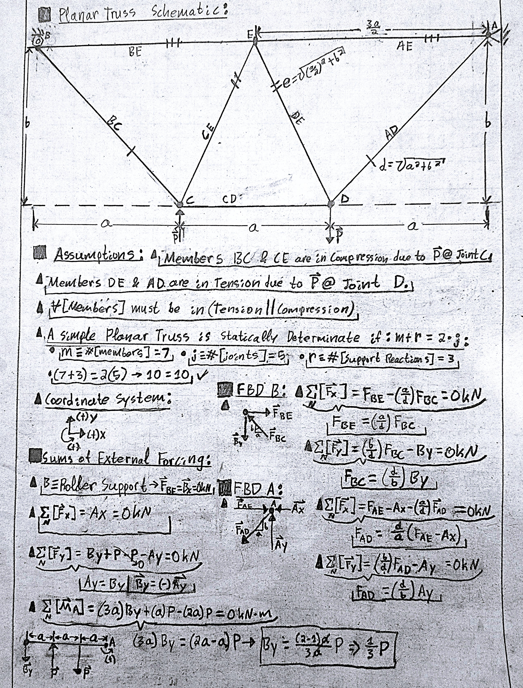
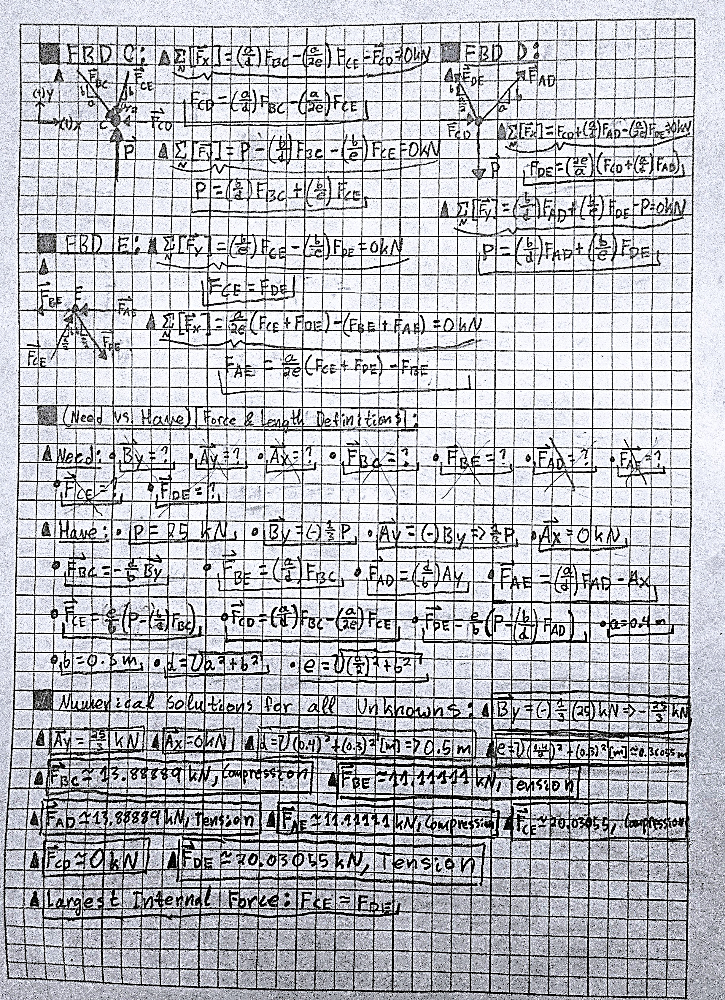
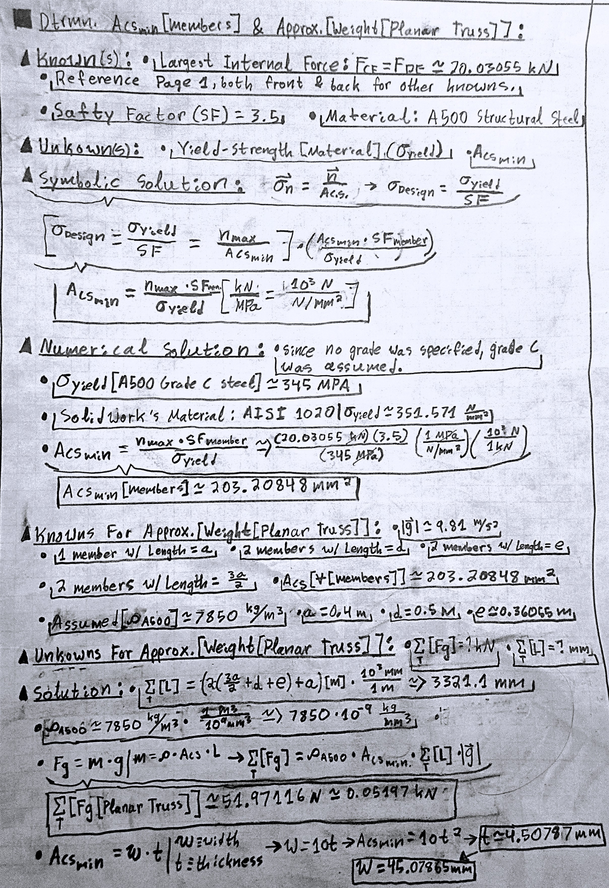
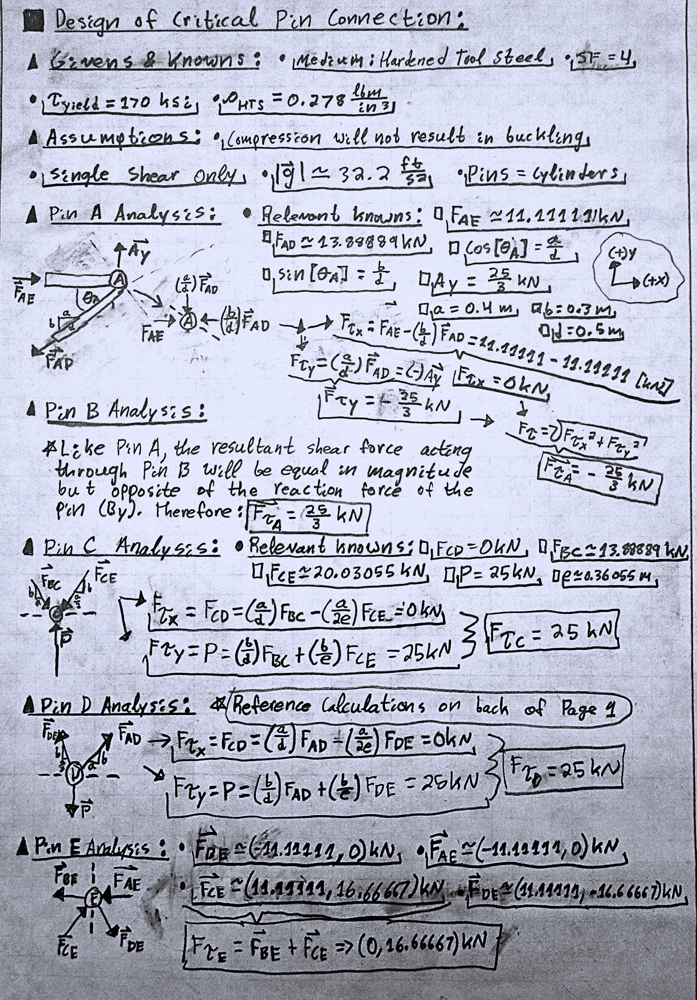
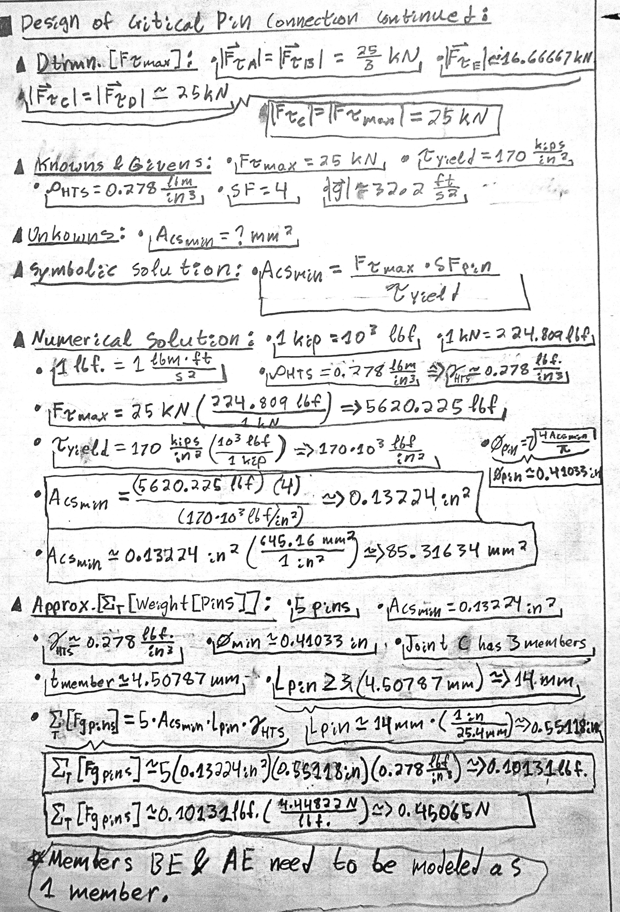
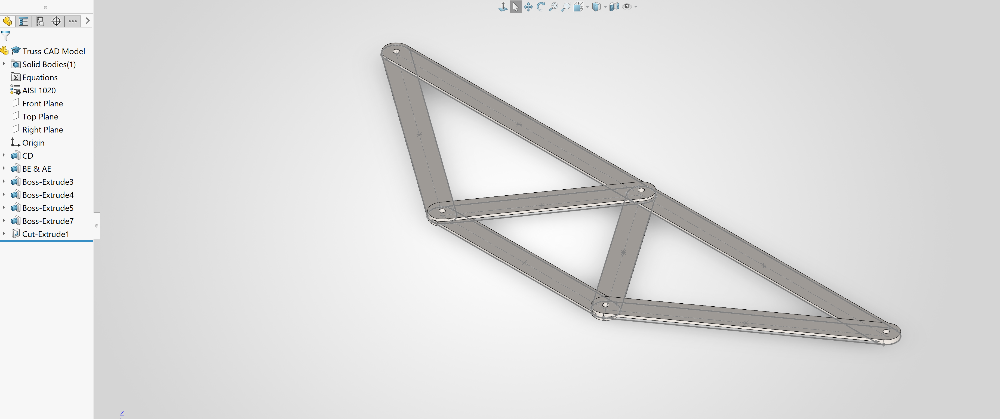

# A2 – Truss Stress Analysis

## Objective:

The objective of this assignment was to design a lightweight planar truss capable of supporting the prescribed loading while satisfying required safety factors. The truss members were analyzed using static equilibrium and the method of joints, while the connecting pins were sized using single-shear stress analysis. The analytical results were then used to develop a SOLIDWORKS model for comparison with the calculated geometry and weight.

## Design Requirements and Known Parameters:

The truss was designed using a = 0.4 m, b = 0.3 m, and a selected applied load of P = 25 kN. A500 Grade C structural steel was assumed for the truss members with a member safety factor of 3.5, while hardened tool steel with a shear yield strength of 170 ksi and safety factor of 4 was used for the pins. All truss members were required to use the same cross-sectional geometry and area, and all pins were required to be identical.

## Analyze

### Truss Geometry:
The planar truss geometry was designed using the given dimensions of a = 0.4 m and b = 0.3 m. Seven members and five joints were selected to produce a statically determinate planar truss satisfying m + r = 2j. The complete geometry, assumptions, support-reaction analysis, and initial joint free-body diagrams are shown below.

*Figure 1. Initial planar truss geometry, determinacy check, support reactions, and free-body diagrams for Joints A and B.*

### Support Reactions:

The external support reactions were found before method of joints was used. Horizontal sum of forces produced a zero horizontal reaction at A, while vertical sum of forces and sum of moments about joint A were used to identify the vertical reactions at A and B. The symbolic work and corresponding whole-truss free-body diagram are included in Figure 1.

### Joint Free Body Diagrams:

A free-body diagram corresponding to each joint was drawn so that the internal axial forces could be found with method of joints. Member-force directions were established from the tension or compression behavior of the corresponding members and resolved using the defined positive x- and y-coordinate directions. The diagrams for Joints A and B are shown in Figure 1, while the remaining joints are shown in Figure 2.

### Symbolic Member-Force Analysis:

Method of joints was used to determine the internal member forces symbolically before numerical substitution. The diagonal member lengths were represented by d and e so that the equilibrium equations could be maintained in symbolic form. Figure 2 shows the remaining joint FBDs and the symbolic relationships used to determine the member forces.

*Figure 2. Free-body diagrams for Joints C, D, and E with symbolic and numerical member-force calculations.*

### Numerical Member-Force Analysis:

The given dimensions and a chosen load of P = 25 kN were substituted into the symbolic relationships. The resulting internal forces were classified as tension, compression, or zero-force based on their directions. The complete numerical calculations are shown in Figure 2.

### Critical Member Identification:

The largest internal-force magnitude occurred in members CE and DE. Both members carried approximately 20.03 kN, with CE in compression and DE in tension. This force magnitude was therefore used to determine the minimum common cross-sectional area for all truss members.

### Truss Member Cross-Section Design:

#### Knowns and Unknowns:

The largest internal force, required safety factor, and A500 Grade C steel properties were used to size the common member cross-section. Normal stress was compared with the allowable yield stress after application of the required safety factor of 3.5. The symbolic derivation, numerical minimum area, approximate truss weight, and selected rectangular proportion are shown below.

*Figure 3. Minimum truss-member cross-sectional area and approximate planar-truss weight calculations.*
#### Symbolic Solution:

The symbolic normal-stress derivation is shown in Figure 3.

#### Numerical Solution:

The resulting theoretical minimum member area was approximately **203.21 mm²** using A500 Grade C steel.

#### Estimated Truss Weight:

Using the theoretical minimum area and total member length, the analytical truss weight was estimated as approximately **51.97 N**.

### Pin Design:

#### Critical Pin FBD:

The shear-force resultants were evaluated at each pin before sizing the common pin cross-section. Pins C and D were found to carry the largest resultant shear force, with a magnitude of 25 kN, and therefore control the identical-pin design. The individual pin-force analyses are shown below.

*Figure 4. Resultant shear-force analysis for Pins A through E used to identify the critical pin connection.*

#### Knowns and Unknowns:

When performing the analysis for each of the individual pins contained within Figure 4, the listed knowns and unknowns were listed based off of their relevancy to the pin in question. To avoid repetition, each known or given value were only mentioned once. Should any known or given values be missing from Figure 4, their derivations and values are available within Figure 2.

#### Symbolic Single-Shear Analysis:

The required pin area was determined using the maximum 25 kN shear force, the hardened-tool-steel shear yield strength, and the required safety factor of 4. Because the problem specifies a single-shear connection, one shear plane was used in the stress calculation. The symbolic and numerical calculations are shown below.

*Figure 5. Critical single-shear pin sizing, minimum diameter, selected pin length, and estimated combined pin weight.*

#### Numerical Pin Size:

The minimum calculated pin area was approximately **85.32 mm²**, corresponding to a minimum cylindrical diameter of approximately **10.42 mm**.

#### Estimated Pin Weight:

The identical pins were sized using the calculated minimum cross-section and a common length based on the member stack at the joints. The approximate combined weight calculation for the five pins is included in Figure 5.

## Decide:

### Geometry Selection:

A seven-member, five-joint triangulated geometry was selected because it satisfied the planar-truss determinacy relationship m + r = 2j while remaining simple enough for hand analysis. The geometry uses the given locations of A, B, C, and D while adding Joint E to form stable triangular regions. This configuration was selected to reduce unnecessary structural complexity while maintaining stability and allowing all internal member forces to be determined using the method of joints.

### Member Cross-Section Selection:

A rectangular member cross-section with an approximate 10:1 width-to-thickness ratio was selected to produce a thin planar structure similar to the provided CAD example. The calculated theoretical minimum area was approximately 203.21 mm², resulting in dimensions near 45.08 mm wide by 4.51 mm thick. This geometry was selected because it satisfies the required cross-sectional area while limiting material usage and providing reasonable in-plane width around the pin connections.

### Pin Size Selection:

Pins C and D were identified as the critical connections because each transmits a resultant shear force of 25 kN. Applying the required safety factor of 4 and the 170 ksi shear yield strength produced a minimum pin area of approximately 85.32 mm² and a minimum diameter of approximately 10.42 mm. A common pin size was selected from this critical case because the assignment requires all pins to be identical.

## Communicate:

### CAD Model:

The completed planar truss geometry was modeled in SOLIDWORKS as a single part in accordance with the assignment instructions and Appendix B. The analytical member dimensions were transferred into the CAD geometry while maintaining the required common cross-sectional area through the truss members and joint regions. The current completed truss model is shown below.

*Figure 6. Completed SOLIDWORKS model of the planar truss.*

The truss body was completed within the available assignment time. Additional CAD development of the individual pins was not completed before submission.

### CAD Mass Properties:

The truss geometry was completed in SOLIDWORKS, but the full pin model and final mass-properties verification were not completed before submission.

### Analytical and CAD Weight Comparison:

The analytical truss weight based on the theoretical minimum member area was approximately 51.97 N. A complete comparison with the SOLIDWORKS mass prediction could not be performed before submission because the final CAD model, including the pins, was not completed. The analytical result is retained as the design estimate for comparison during a future model revision.

### CAD File Download:

The available SOLIDWORKS CAD file for the planar truss can be downloaded below.

[**Download A2 Planar Truss SOLIDWORKS Part**](files/A2_Truss.SLDPRT)

## Mistakes and Design Iterations:

An early version of the truss contained only six members and did not satisfy the determinacy requirement, so member CD was added to produce a stable seven-member truss. Several initial free-body diagrams also contained member-force arrows inconsistent with the final tension and compression states, requiring the joint diagrams and symbolic equations to be revised. During the pin analysis, I initially confused support reactions with the resultant force transmitted through a single-shear plane, which was corrected by evaluating the vector resultant of the forces acting on one side of each pin connection. I initially designed the pin length to be greater than four times the chosen member thickness because BE and AE were designed as separate members, I ran into issues during the modeling process and ended up modeling them as a single member.

## Engineering Lessons Learned:

## Assignment Time:

This assignment took me approximately 18 hours.
