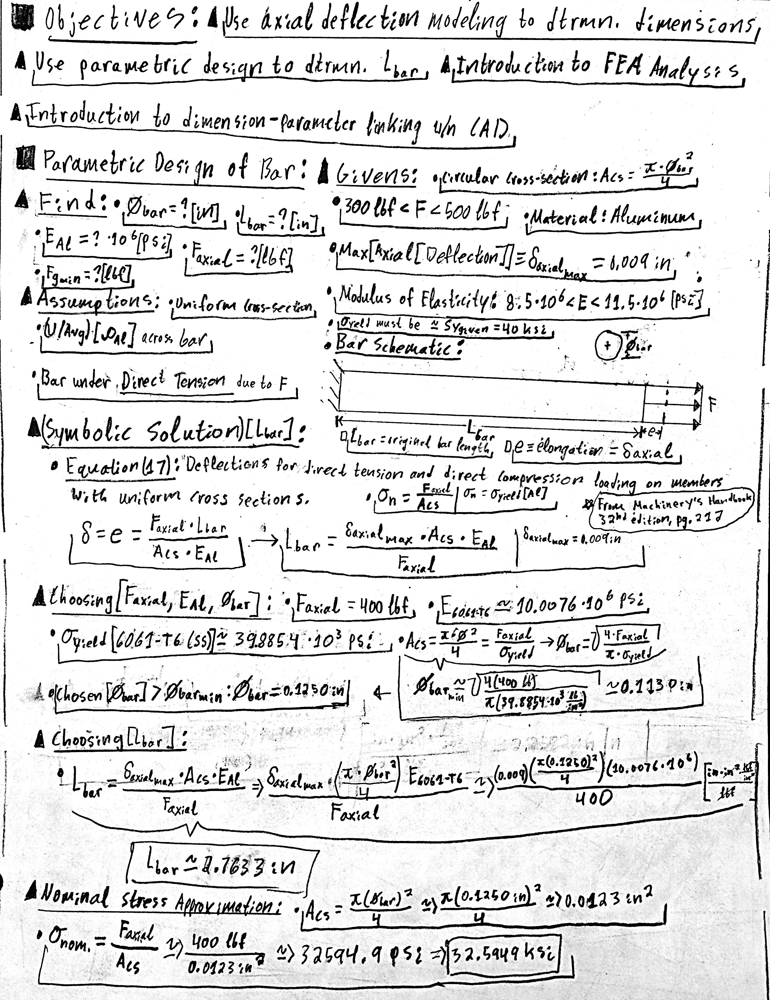
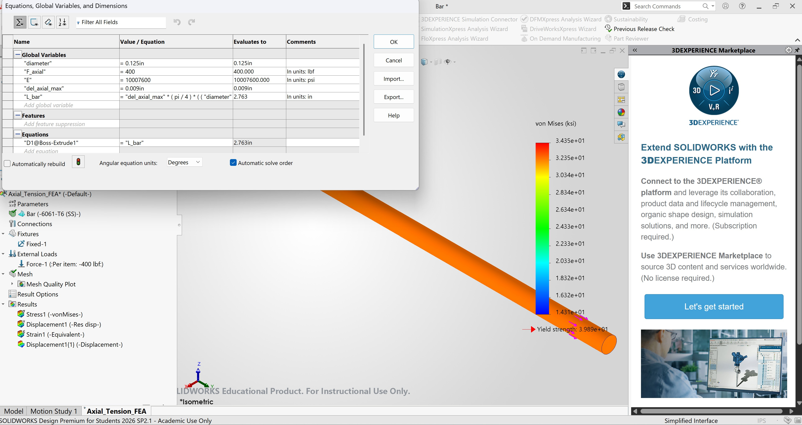
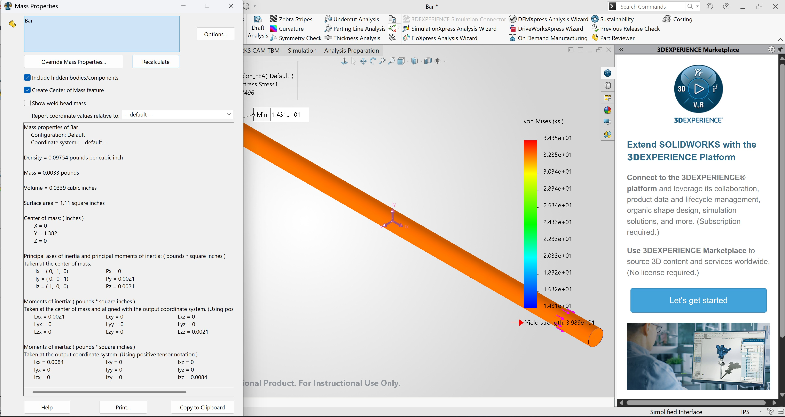
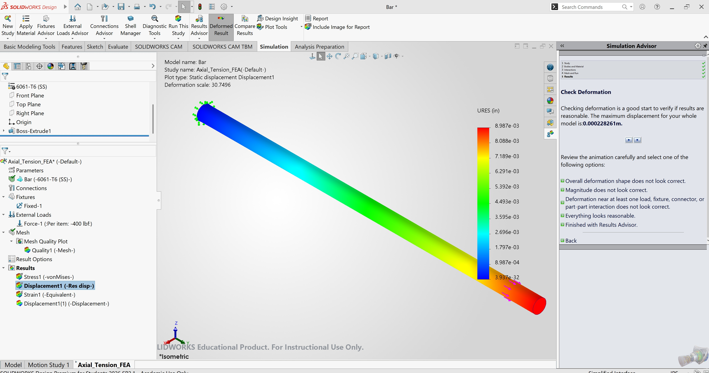
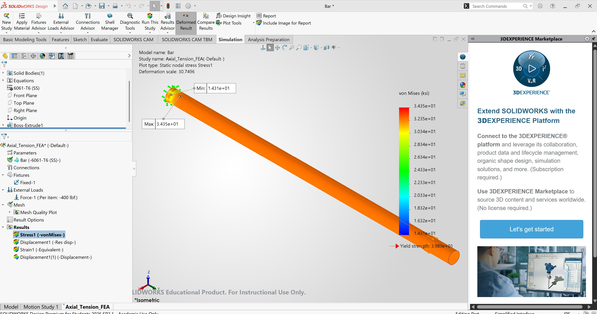
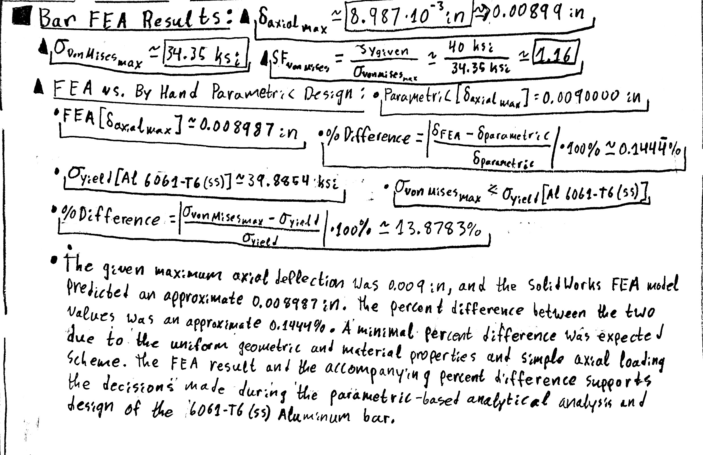

# A3 – Parametric Bar Design and FEA:

## Objective:

The objective of this assignment was to design an aluminum bar for a specified axial-deflection limit using analytical parametric design and finite element analysis. The bar geometry was first determined from the direct axial-deformation relationship and then replicated parametrically in SOLIDWORKS. A static FEA study was then used to compare the predicted displacement and stress with the analytical design.

## Design Requirements and Selected Parameters:

The design required a circular aluminum bar subjected to a direct uniform tensile distributed-load between 300 lbf and 500 lbf, with a maximum axial deflection of 0.009 in, yield strength of approximately 40 ksi, and a modulus of elasticity between 8.5 * 10^6 and 11.5 * 10^6 psi. The selected design used a 400 lbf load, 6061-T6 (SS) aluminum with a modulus of elasticity of approximately 10.0076 × 10^6 psi, and a selected bar diameter of 0.125 in. The resulting analytical and parametric bar length was approximately 2.763 in.

## Analyze:

### Parametric Design:

The bar was designed using the direct axial-deformation relationship for a uniform member in tension obtained from pg. 212 of the Machinery's Handbook 32nd Edition. The selected load of F = 400 lbf. was chosen from the specified load-range constraint: 300 lbf. < F < 500 lbf. The selected material 6061-T6 (SS) aluminum was chosen from the specified material constraints: Yield Strength must be approximately 40 ksi., Modulus of Elasticity (E): 8.5 * 10^6 < E < 11.5 * 10^6 psi. The minimum bar diameter was calculated using the direct tension stress equation from "Table 2. Table of Simple Stresses" on pg. 210 of the Machinery's Handbook 32nd Edition, and a working bar diameter of 0.125 in was chosen for manufacturing reasons. Using the specified maximum allowable axial deflection of 0.009 in, the previously found parameters, and the direct axial-deformation relatioship the corresponding bar length was determined analytically before the CAD model was generated.

*Figure 1. Hand calculations used to select the bar diameter, material, and parametrically determine the required bar length.*

### SOLIDWORKS Parametric Model:

The analytical design variables were transferred into SOLIDWORKS using global variables and linked equations. The bar diameter, axial load, modulus of elasticity, maximum allowable axial deflection, and calculated length were represented parametrically so that changes to the selected design variables could update the bar geometry. The extrusion length was linked directly to the calculated `L_bar` variable.

*Figure 2. SOLIDWORKS global variables and equations used to parametrically manipulate the bar geometry.*

### Bar Mass Properties:

The completed parametric bar was assigned 6061-T6 (SS) aluminum alloy in SolidWorks. Mass Properties was then used to determine the physical properties of the completed geometry. The calculated CAD mass was approximately 0.0033 lb for the selected 0.125 in diameter and approximately 2.763 in length.

*Figure 3. SOLIDWORKS Mass Properties for the completed aluminum bar.*

### Finite Element Analysis:

#### FEA Boundary Conditions and Loading:

A static finite element study was created using the same 6061-T6 (SS) material and 400 lbf load used during the parametric design. One circular end face was fully fixed and a 400 lbf tensile load was applied normally to the opposite circular end face. A high-quality tetrahedral mesh was generated before solving the study.

#### Displacement Results:

The FEA predicted a maximum resultant displacement of approximately **0.008987 in** at the loaded end of the bar. Displacement increased smoothly from approximately zero at the fixed end to the maximum at the loaded end, as expected for a uniform bar under direct axial tension.

*Figure 4. FEA resultant displacement map for the aluminum bar.*

#### von Mises Stress Results:

The maximum von Mises stress predicted by the FEA was approximately **34.35 ksi**. This value remained below the assignment design strength of 40 ksi, producing an approximate safety factor of **1.16** based on the maximum FEA stress and calculated nominal stress.

*Figure 5. FEA von Mises stress distribution for the aluminum bar.*

## Decide:

### Bar Geometry Selection:

A circular bar diameter of 0.125 in was selected after the minimum diameter required by the tensile-stress calculation was found to be approximately 0.113 in. The 0.125 in diameter was selected because it exceeds the theoretical minimum while providing a simple practical dimension for the CAD model and manufacturing processing. Using this diameter with the selected load, modulus of elasticity, and maximum axial deflection produced a required bar length of approximately 2.763 in.

### Material Selection:

6061-T6 (SS) aluminum was selected from the SOLIDWORKS material library because its modulus of elasticity of approximately 10.0076 × 10^6 psi lies within the specified range. Its listed yield strength of approximately 39.89 ksi is also very close to the 40 ksi strength specified for the assignment's FEA comparison. Using the same material properties in both the parametric calculations and FEA helped maintain consistency between the two analysis methods.

## Communicate:

### Parametric and FEA Comparison:

The specified maximum axial deflection was **0.009 in**, and the SOLIDWORKS FEA model predicted a maximum displacement of approximately **0.008987 in**. The percent difference between the two values was approximately **0.1444%**, demonstrating very close agreement between the analytical and finite-element approaches. A minimal percent difference was expected due to the uniform geometric and material properties, and the simple axial loading scheme. The FEA analysis also proved that the maximum stress experienced by the designed bar would not exceed the specified yield strength of the aluminum used. The FEA results and the accompanying percent difference calculations support the decisions made during the parametric-based analytical analysis and design of the 6061-T6 (SS) aluminum bar.

*Figure 6. Hand calculations comparing the analytical parametric design with the SOLIDWORKS FEA results.*

### CAD File Download:

The completed parametric SOLIDWORKS model can be downloaded using the link below.

[**Download A3 Parametric Bar SOLIDWORKS Part**](files/Bar.SLDPRT)

## Mistakes and Design Iterations:

During the initial analytical design, different aluminum materials available in the SOLIDWORKS material library were considered before 6061-T6 (SS) was selected. Additional difficulty occurred while creating SOLIDWORKS global variables because force and modulus values could not be assigned conventional force or pressure units in the same manner as dimensional variables. The equations were therefore structured so that the numerical force and modulus values were documented with their intended units while the bar diameter and resulting extrusion length remained parametrically linked.

## Engineering Lessons Learned:

This assignment demonstrated how analytical equations can be incorporated directly into a parametric CAD model instead of using CAD dimensions only as fixed numerical inputs. I also gained experience in creating a SolidWorks FEA Study and learned how a finite element displacement result can be compared with a closed-form axial-deformation calculation to determine whether my simulation setup or analytical calculations are producing physically reasonable results. The approximately 0.1444% difference between the analytical and FEA displacement predictions demonstrated that simple analytical models can agree very closely with FEA when the geometry, material, loading, and boundary conditions closely match the assumptions of the analytical equation.

## Assignment Time:

This assignment took me approximately **10 hours** from initial calculations through CAD modeling, finite element analysis, and documentation.
