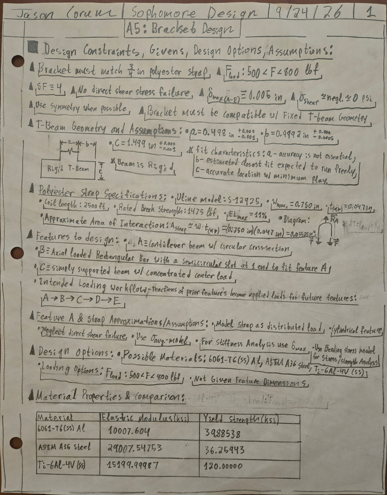
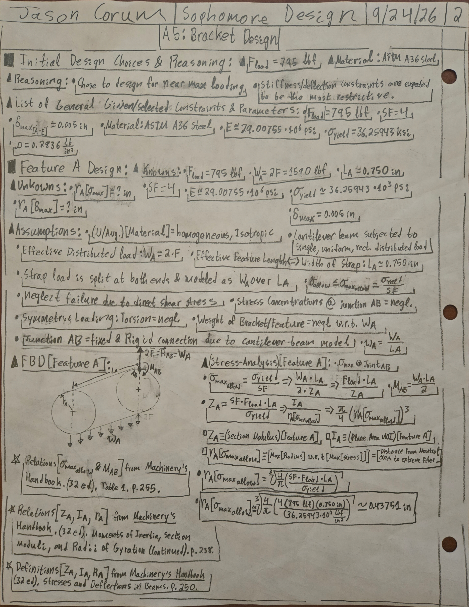
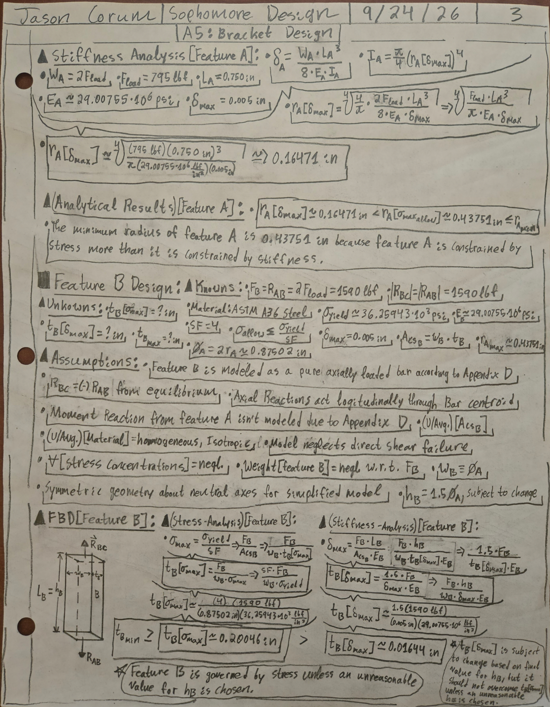
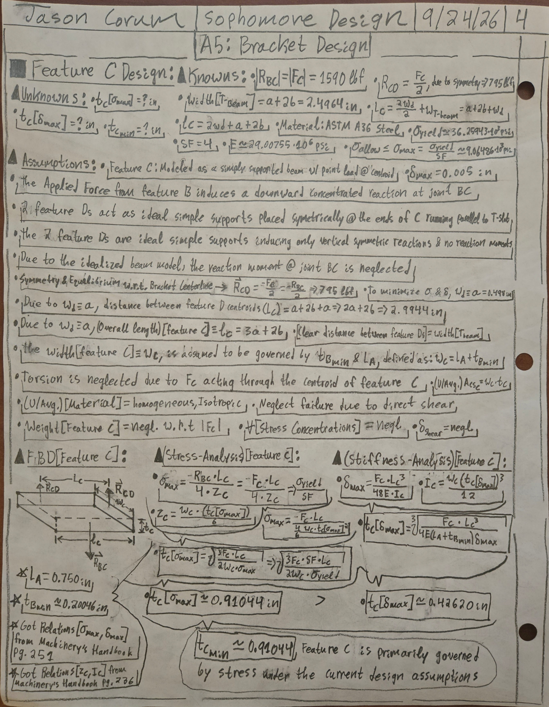
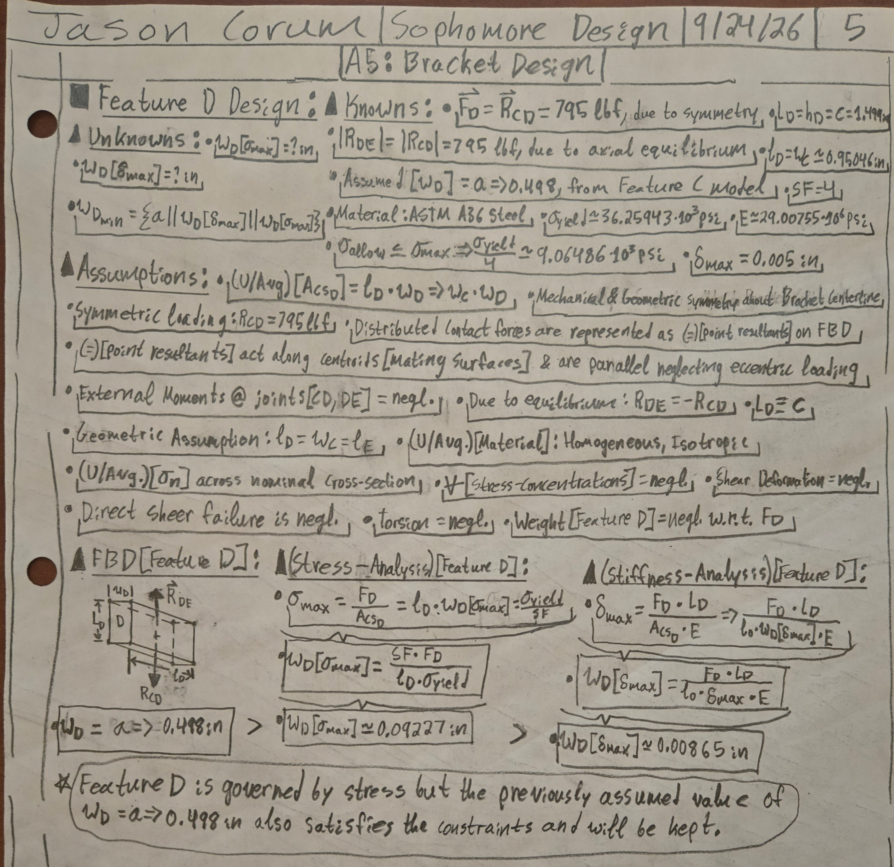
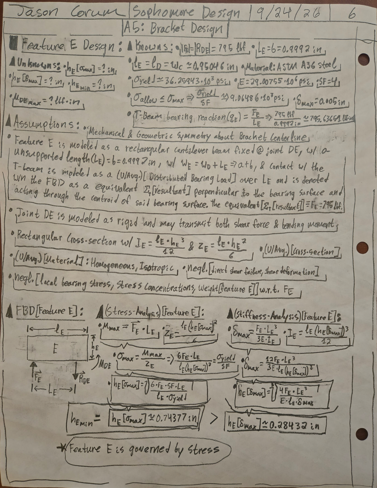
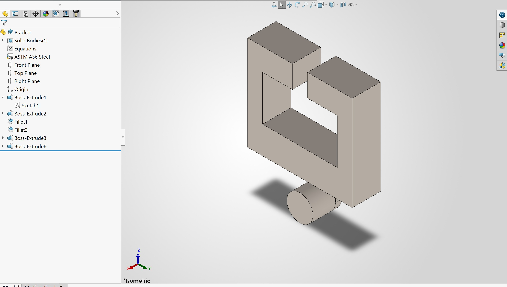

# A5 – Bracket Design:

## Objective:

The objective of this assignment was to design a structural bracket using fundamental strength-of-materials methods. Five structural features were individually modeled using appropriate normal stress, bending stress, and deflection relationships. Each feature was sized independently for stress and stiffness, after which the governing dimensions were used to define the final bracket geometry.

## Design Requirements and Selected Parameters:

The bracket was required to support two symmetric polyester-strap loads using a safety factor of 4 while limiting the deflection of each analyzed feature to 0.005 in. Failure due to direct shear stress and shear deformation were neglected as specified by the assignment.

A near-maximum permitted load of 795 lbf was selected for each strap load. ASTM A36 steel was selected because its comparatively high elastic modulus was expected to be advantageous for the stiffness requirements of the bracket.

Selected material properties:

- Elastic modulus: 29.00755 × 10^6 psi
- Yield strength: 36.25943 ksi
- Density: 0.2836 lb/in³
- Safety factor: 4
- Allowable normal/bending stress: approximately 9.06486 ksi
- Maximum allowable deflection per feature: 0.005 in

*Figure 1. Initial design constraints, material options, strap properties, and design assumptions.*

## Concept Geometry and Load Workflow:

The supplied bracket concept was divided into five structural features labeled A through E. Reactions calculated for one feature were carried forward as applied loads for subsequent features, producing the approximate load workflow: A → B → C → D → E.

Feature A was modeled as a cantilever with a circular cross-section, Feature B as an axially loaded rectangular bar, Feature C as a simply supported beam with a concentrated center load, Feature D as two symmetric axially loaded supports, and Feature E as two symmetric cantilever members.

## Material and Load Selection:

## Stress and Stiffness Analysis:

### Feature A – Strap Support:

Feature A supports the polyester strap and was modeled as a circular cantilever subjected to a uniformly distributed load. The two 795 lbf strap loads produce a total equivalent load of 1590 lbf over an assumed effective length of 0.750 in.

#### Feature A Stress Analysis:

The allowable bending stress was based on the ASTM A36 yield strength divided by the required safety factor. The bending-stress analysis produced a minimum radius of approximately:

**rA,stress = 0.43751 in**

#### Feature A Stiffness Analysis:

Using the cantilever-beam deflection relationship and the 0.005 in maximum-deflection constraint, the stiffness analysis produced:

**rA,stiffness = 0.16471 in**

#### Feature A Design Result:

Because the stress requirement was larger than the stiffness requirement, stress governed the design of Feature A.

**Minimum Feature A radius = 0.43751 in**

**Minimum Feature A diameter = 0.87502 in**

*Figure 2. Feature A assumptions, free-body diagram, and bending-stress analysis.*

### Feature B – Axially Loaded Member:

Feature B was modeled as a purely axially loaded rectangular member. Its width was assumed equal to the calculated diameter of Feature A, while its height was assumed to equal 1.5 times the diameter of Feature A. The remaining thickness was determined from the stress and stiffness requirements.

#### Feature B Stress Analysis:

The axial-stress analysis produced:

**tB,stress = 0.20046 in**

#### Feature B Stiffness Analysis:

The axial-deformation analysis produced:

**tB,stiffness = 0.01644 in**

#### Feature B Design Result:

Stress governed Feature B.

**Minimum Feature B thickness = 0.20046 in**

*Figure 3. Feature A stiffness calculation and both the axial stress and stiffness analyses for Feature B*

### Feature C – Simply Supported Beam:

Feature C was modeled as a simply supported rectangular beam with the 1590 lbf reaction from Feature B applied as a concentrated load at its center. The two Feature D members were modeled as symmetric simple supports.

The effective support-to-support span was defined as:

**LC = 2a + 2b = 2.9944 in**

The overall physical length of Feature C was defined as:

**lC = 3a + 2b = 3.4924 in**

The width was defined from the preceding geometry as:

**wC = LA + tB = 0.95046 in**

The thickness tC was treated as the design variable.

#### Feature C Stress Analysis:

The bending-stress analysis produced:

**tC,stress = 0.91044 in**

#### Feature C Stiffness Analysis:

The simply-supported-beam deflection analysis produced:

**tC,stiffness = 0.42620 in**

#### Feature C Design Result:

Stress governed Feature C.

**Minimum Feature C thickness = 0.91044 in**

*Figure 4. Feature C geometry assumptions, free-body diagram, and stress and stiffness analyses.*

### Feature D – Axially Loaded Supports

The two Feature D members were modeled symmetrically as axially loaded rectangular members. Each support carries one half of the Feature C load, or 795 lbf.

The axial length was defined by the T-beam dimension c, while the into-page length was assumed equal to the width of Feature C. The Feature D width was analyzed to determine whether the preliminary value of a = 0.498 in was sufficient.

#### Feature D Stress Analysis:

The stress analysis produced:

**wD,stress = 0.09227 in**

#### Feature D Stiffness Analysis:

The axial-deformation analysis produced:

**wD,stiffness = 0.00865 in**

#### Feature D Design Result:

Although stress governed the analytical requirement, both calculated minimum dimensions were substantially smaller than the geometry-based value of 0.498 in. Therefore:

**Selected Feature D width = a = 0.498 in**

*Figure 5. Feature D assumptions, free-body diagram, and axial stress and stiffness analyses.*

### Feature E – Upper Cantilever Supports:

The two Feature E members were modeled symmetrically as rectangular cantilevers fixed at the D-E connection. Each feature carries a 795 lbf load. A conservative point-load model was used in place of a distributed bearing load.

The effective cantilever length was:

**LE = b = 0.9992 in**

The into-page dimension was assumed equal to the Feature D length and Feature C width:

**lE = 0.95046 in**

The height hE was treated as the design variable.

#### Feature E Stress Analysis:

The conservative point-load bending-stress analysis produced:

**hE,stress = 0.74377 in**

#### Feature E Stiffness Analysis:

The corresponding cantilever deflection analysis produced:

**hE,stiffness = 0.28432 in**

#### Feature E Design Result:

Stress governed Feature E.

**Minimum Feature E height = 0.74377 in**

*Figure 6. Feature E assumptions, cantilever free-body diagram, and stress and stiffness analyses.*

## Final Analytical Dimensions:

| Feature | Stress Requirement | Stiffness Requirement | Selected/Governing Dimension |
| --- | ---: | ---: | ---: |
| A | r = 0.43751 in | r = 0.16471 in | r = 0.43751 in |
| B | t = 0.20046 in | t = 0.01644 in | t = 0.20046 in |
| C | t = 0.91044 in | t = 0.42620 in | t = 0.91044 in |
| D | w = 0.09227 in | w = 0.00865 in | w = 0.498 in |
| E | h = 0.74377 in | h = 0.28432 in | h = 0.74377 in |

Stress governed Features A, B, C, and E under the selected analytical models. Feature D was also stress-governed analytically, but its final dimension was instead controlled by the assumed bracket geometry.

## CAD Model:

The final bracket geometry was modeled in SOLIDWORKS using the dimensions obtained from the stress and stiffness analyses of Features A through E. The completed model reflects the final selected feature sizes used for the bracket design.

*Figure 7. Completed SOLIDWORKS model of the designed bracket.*

### CAD File Download:

[Download the completed SOLIDWORKS bracket file](files/Bracket.SLDPRT)

## Mistakes and Design Iterations:

## Lessons Learned:

### Governing Failure Mode

Feature C provides a clear comparison between stress- and stiffness-controlled sizing. The stress analysis required a thickness of approximately 0.91044 in, while the stiffness analysis required approximately 0.42620 in. Stress therefore governed the final Feature C thickness by approximately 0.48424 in.

### Error Propagation

The geometry of later features depended directly on dimensions calculated earlier in the design process. For example, the Feature A diameter was used to establish the width and height of Feature B. The governing Feature B thickness was then used with the Feature A length to determine the width of Feature C. Therefore, an error in an early calculation could propagate through several later feature dimensions. Carrying symbolic relationships forward before substituting numerical values helped make these dependencies easier to identify and check.

### Assumption Sensitivity

Feature E demonstrated the sensitivity of the design to the assumed load distribution. A uniformly distributed bearing-load model initially produced a smaller required height, while modeling the same load conservatively as a concentrated free-end load increased both bending stress and deflection requirements. The conservative point-load model was ultimately retained because the exact bearing distribution was uncertain.

### Governing Failure Mode:

### Error Propagation:

### Assumption Sensitivity:

## Assignment Time:

## References
