# A6 – Parametric Bracket Model and Engineering Drawing:

## Objective:

The objective of this assignment was to continue the bracket design developed in Assignment A5 by converting the bracket into a fully parametric SOLIDWORKS model and creating a fully dimensioned third-angle multiview engineering drawing.

The parametric model was driven by the strength-analysis equations and geometric relationships developed during A5. The final engineering drawing included functional dimensions, engineered sliding-fit tolerances, general tolerances, centerlines, center marks, material information, and a completed title block.

## Previous Design Basis:

The A6 bracket was based on the final design developed during Assignment A5.

The selected design conditions were:

- Material: ASTM A36 Steel
- Applied strap load: 795 lbf per side
- Safety factor: 4
- Yield strength: approximately 36.259 ksi
- Elastic modulus: approximately 29.008 × 10^6 psi
- Maximum allowable deflection: 0.005 in

The bracket was divided into five structural features:

- Feature A – circular cantilever strap support
- Feature B – axially loaded rectangular member
- Feature C – simply supported rectangular beam
- Feature D – two symmetric axial support members
- Feature E – two symmetric upper cantilever members

The governing dimensions developed during A5 were used as the basis for the A6 parametric model.

## Parametric Design:

### Global Variables and Equations:

The bracket was rebuilt using SOLIDWORKS global variables and equations so that the geometry could update automatically when governing design variables changed.

The primary input parameters included:

- `F_load`
- `SF`
- `Yield Strength`
- `E`
- `max deflection`
- `a`
- `b`
- `c`
- `L_A`

Additional calculated variables were created for the dimensions of Features A through E and for the three required sliding-fit clearances.

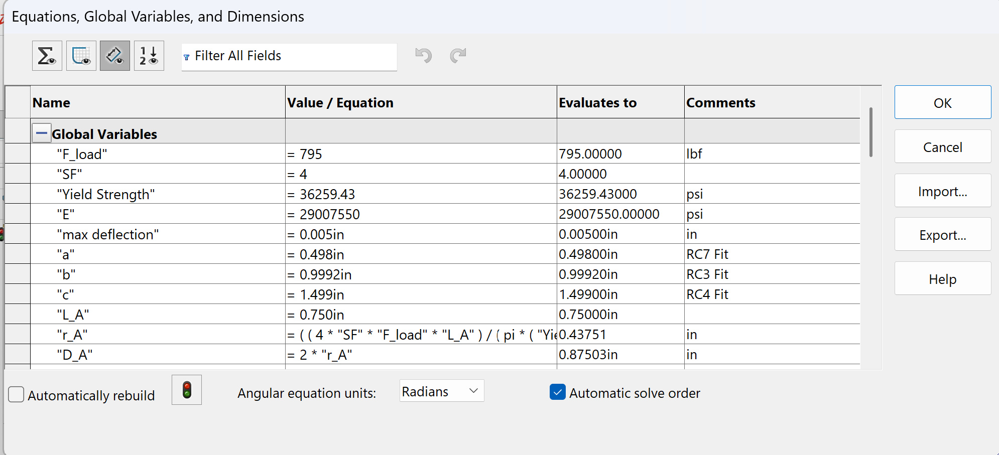

*Figure 1. Primary material, loading, geometric, and Feature A variables used in the parametric model.*

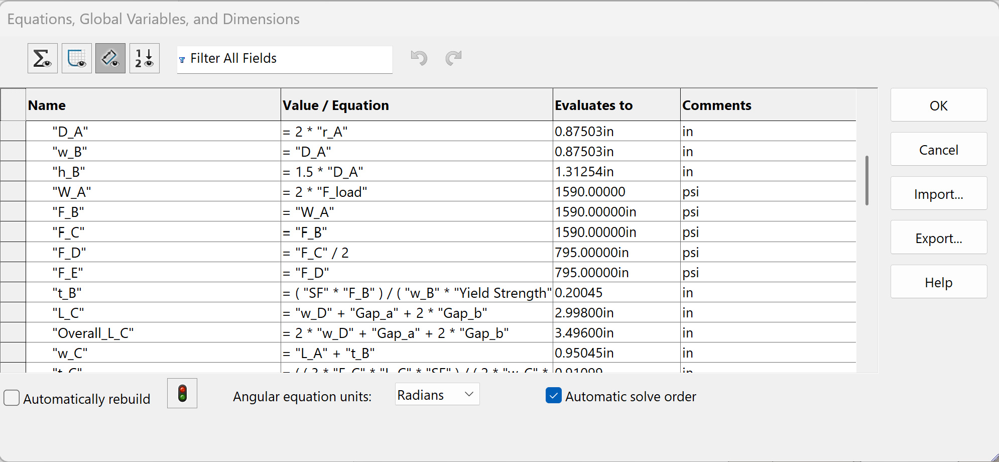

*Figure 2. Parametric load relationships and calculated dimensions connecting Features B and C to the preceding geometry.*

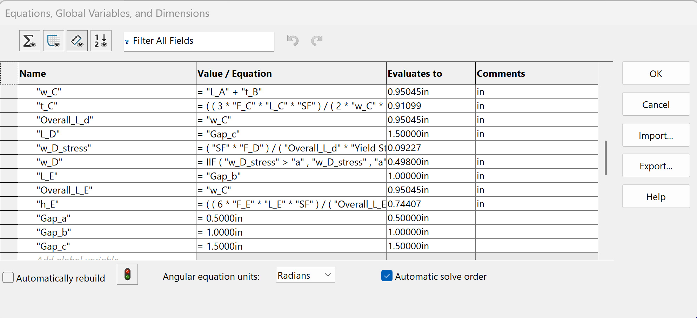

*Figure 3. Remaining feature equations and the independently defined sliding-fit gap parameters.*

### Analytical Equation Used to Drive the Model:

One of the primary analytically controlled dimensions was the radius of Feature A.

From the A5 bending-stress analysis,

\[
r_A =
\left(
\frac{4(SF)(F_{load})(L_A)}
{\pi \sigma_{yield}}
\right)^{1/3}
\]

This relationship was entered directly into the SOLIDWORKS equation manager instead of calculating the value separately and manually entering the resulting radius.

The Feature A diameter was then defined parametrically as:

\[
D_A = 2r_A
\]

Therefore, changes to the applied load, safety factor, material yield strength, or Feature A axial length propagate into the calculated Feature A diameter.

## Parametric Feature Geometry

### Feature A

Feature A was modeled as the circular cantilever strap support analyzed during A5. Its axial length was controlled parametrically while its diameter was calculated from the governing bending-stress equation.

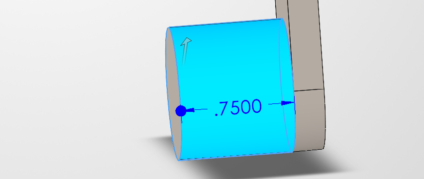

*Figure 4. Parametric control of the 0.750 in axial length of Feature A.*

The calculated Feature A diameter was approximately 0.875 in.

### Feature B

Feature B was modeled as an axially loaded rectangular member.

Its width was related to the calculated Feature A diameter, while its governing thickness was calculated from the A5 axial-stress relationship.

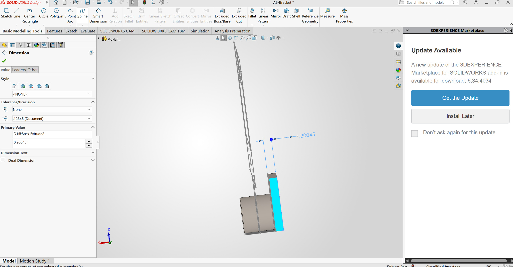

*Figure 5. Feature B thickness controlled by the parametric stress-analysis result.*

The principal Feature B dimensions were approximately:

- Width: 0.875 in
- Height: 1.313 in
- Thickness: 0.200 in

### Feature C

Feature C was modeled as the simply supported beam developed during A5.

Its geometry depended on the neighboring bracket features and the required sliding-fit clearances. Its governing thickness was based on the A5 bending-stress analysis.

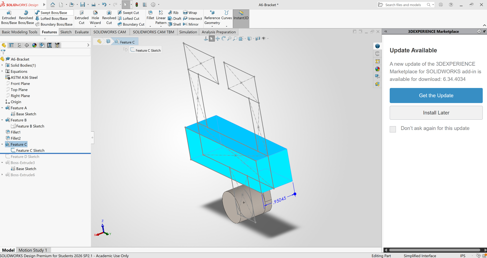

*Figure 6. Feature C extrusion depth tied to the parametric Feature C depth variable.*

The principal Feature C dimensions were approximately:

- Overall length: 3.5 in
- Depth: 0.950 in
- Thickness: 0.911 in

### Feature D

The two Feature D members were modeled symmetrically.

The analytical minimum width calculated during A5 was smaller than the width required by the surrounding geometry, so the geometric value of approximately 0.498 in was retained.

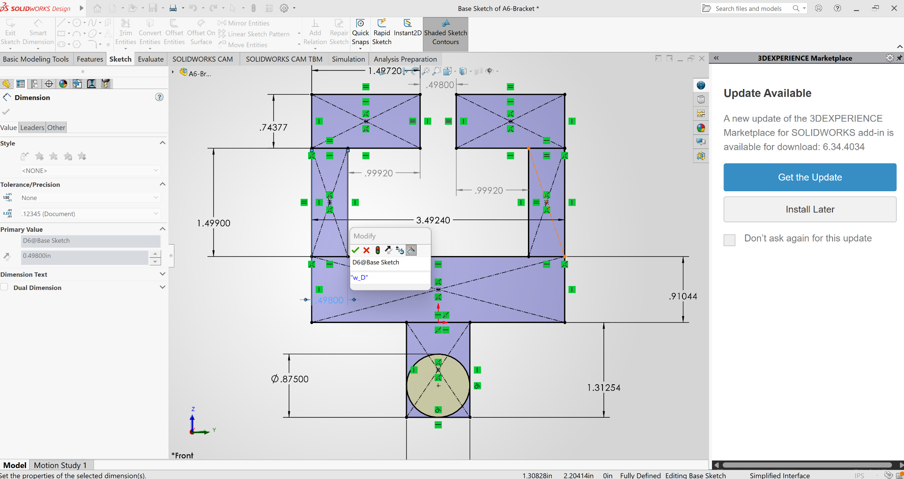

*Figure 7. Parametric width used for the two symmetric Feature D members.*

### Feature E

The two Feature E members were also modeled symmetrically.

The height of Feature E was controlled by the governing A5 bending-stress analysis, while its other dimensions were related to the T-beam fit geometry and Feature C depth.

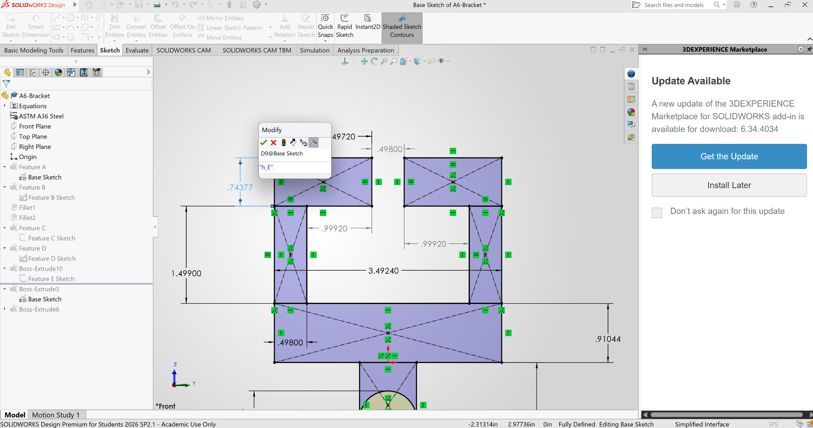

*Figure 8. Parametric height of the two Feature E members.*

The resulting Feature E height was approximately 0.744 in.

## Sliding-Fit Geometry

The bracket is required to slide over three portions of the rigid T-beam. Separate parametric variables were therefore created for each functional opening instead of simply retaining the original nominal T-beam dimensions.

### Gap A

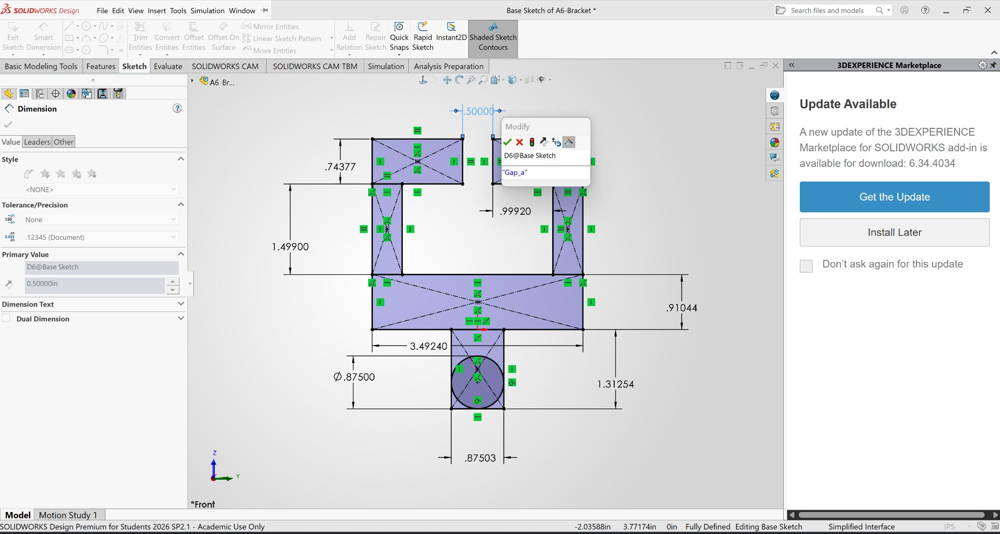

*Figure 9. Parametric definition of Gap A.*

The nominal value was:

\[
Gap_A = 0.5000\text{ in}
\]

with the final drawing tolerance:

\[
+0.0016/-0.0000\text{ in}
\]

### Gap B

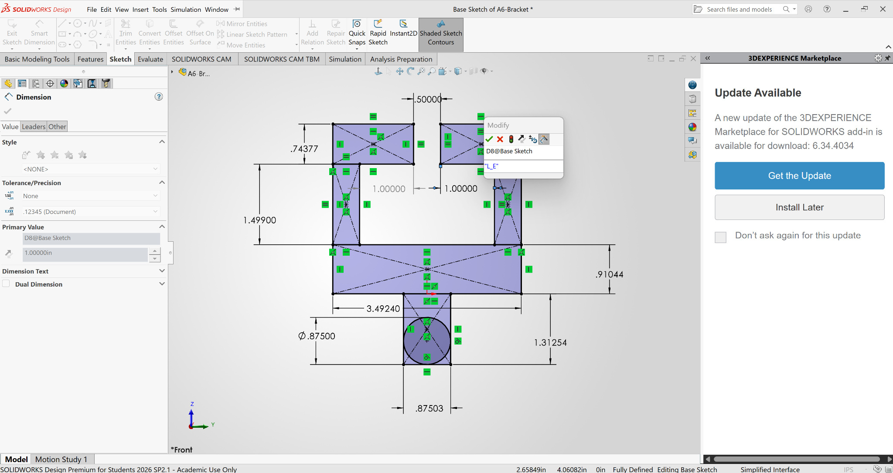

*Figure 10. Parametric definition of the symmetric Gap B dimensions.*

The nominal value was:

\[
Gap_B = 1.0000\text{ in}
\]

with the final drawing tolerance:

\[
+0.0008/-0.0000\text{ in}
\]

### Gap C

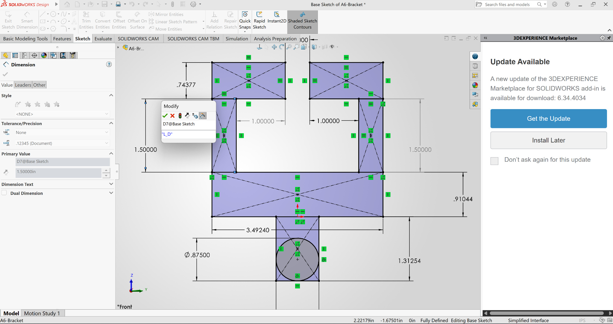

*Figure 11. Parametric definition of the vertical Gap C dimension.*

The nominal value was:

\[
Gap_C = 1.5000\text{ in}
\]

with the final drawing tolerance:

\[
+0.0016/-0.0000\text{ in}
\]

## Final Parametric Geometry

After the individual feature equations and the three fit dimensions were established, the master sketch was checked to confirm that the intended relationships were properly connected.

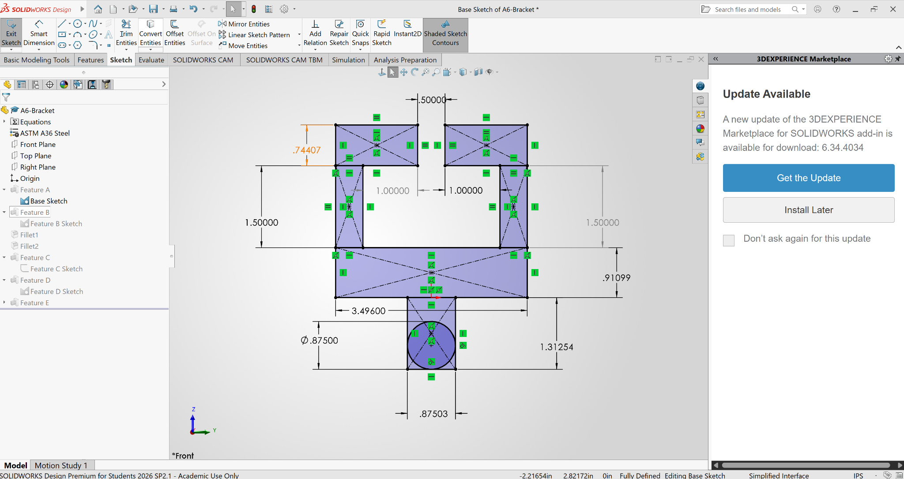

*Figure 12. Final master sketch after updating the governing dimensions and geometric relationships.*

The model was then rebuilt to confirm that the completed bracket remained geometrically valid.

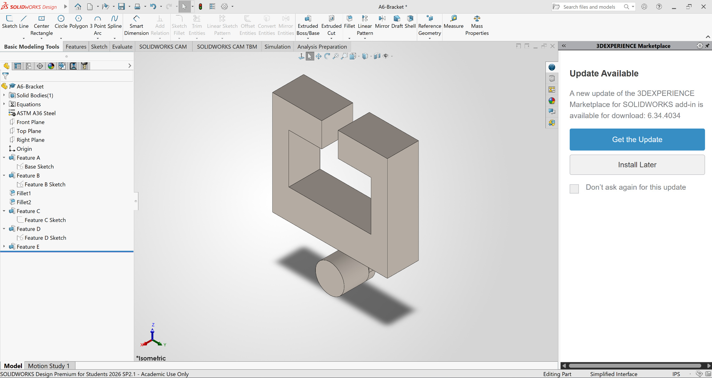

*Figure 13. Completed parametric SOLIDWORKS bracket after rebuilding the model.*

## Engineering Drawing

A third-angle multiview engineering drawing was created from the completed parametric model.

The drawing includes:

- Front view
- Top view
- Right-side view
- Isometric view
- Centerlines and center marks
- Structural dimensions
- Functional dimensions
- Three explicit sliding-fit tolerance callouts
- General tolerance block
- ASTM A36 Steel material designation
- Name and date
- Drawing title
- Drawing number
- 1:1 drawing scale

The Front view was selected as the primary view because it displays the largest number of structural features and communicates the overall bracket geometry most clearly.

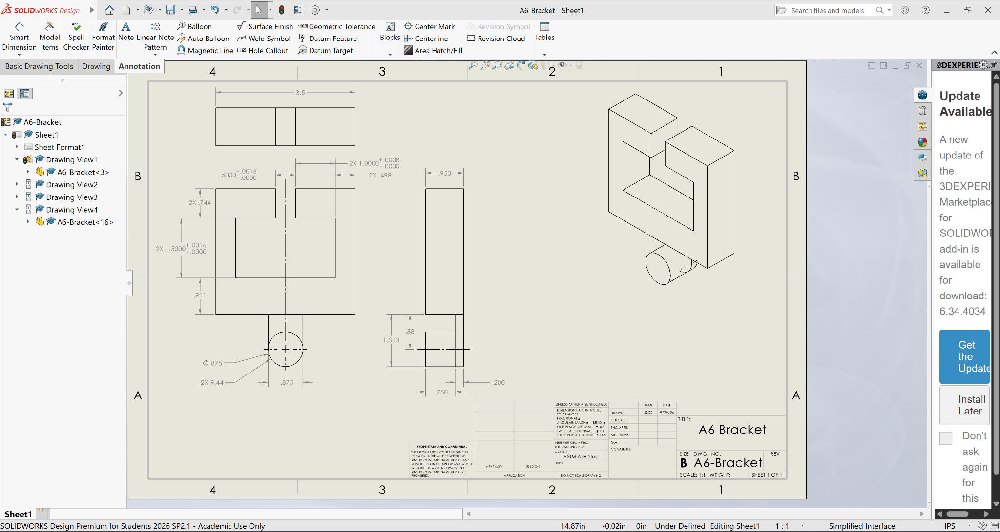

*Figure 14. Completed third-angle multiview engineering drawing of the parametric bracket.*

## Dimension and Tolerance Strategy

The dimensions were separated into categories based on their functional importance.

### Class 3 – Sliding-Fit Dimensions

The three dimensions controlling the sliding fits were given explicit unilateral tolerances and retained at four decimal places.

- Gap A: 0.5000 +0.0016 / -0.0000 in
- 2X Gap B: 1.0000 +0.0008 / -0.0000 in
- 2X Gap C: 1.5000 +0.0016 / -0.0000 in

These explicit tolerances override the general tolerance block.

### Class 2A – Structural Functional Dimensions

Structural dimensions controlled by the previous stress or stiffness analysis were displayed to three decimal places.

Examples included:

- Feature A diameter
- Feature B height
- Feature B thickness
- Feature C thickness
- Feature D width
- Feature E height

Under the general tolerance block, a three-decimal dimension receives:

\[
X.XXX \pm 0.005\text{ in}
\]

### Class 2B – Functional Location Dimensions

Functional dimensions that establish feature length or location but do not require the tighter three-decimal structural tolerance were displayed to two decimal places.

Examples included:

- Feature A axial length
- Feature A centerline location

Under the general tolerance block:

\[
X.XX \pm 0.01\text{ in}
\]

### Class 1 – Non-Critical Dimensions

Dimensions that primarily describe the overall component envelope rather than a critical fit or stress-controlled feature were displayed to one decimal place.

Examples included:

- Feature C overall length
- Feature C depth
- Feature B fillet radii

Under the general tolerance block:

\[
X.X \pm 0.02\text{ in}
\]

Using a looser tolerance on these dimensions avoids imposing unnecessarily restrictive manufacturing requirements on non-critical geometry.

## General Tolerance Block

The drawing uses the required general decimal tolerances:

- X.X ± 0.02 in
- X.XX ± 0.01 in
- X.XXX ± 0.005 in

The three sliding-fit dimensions contain their own explicit tolerances and therefore are not controlled by these general decimal tolerances.

## Mistakes and Design Iterations

Several modifications were required while converting the A5 bracket into a fully parametric model.

One issue was that several dimensions initially retained fixed numerical values instead of being tied to global variables. These were progressively replaced with parametric relationships so that changes to upstream variables would propagate through the model.

Another issue involved the dimensions corresponding to the rigid T-beam. The initial equations used the original `a`, `b`, and `c` dimensions directly. Separate `Gap_a`, `Gap_b`, and `Gap_c` variables were later introduced so that the bracket would represent the actual required sliding-fit openings rather than simply duplicating the T-beam nominal geometry.

The dependent Feature C, D, and E equations were then updated to reference these new gap variables.

The relationship between Feature A and Feature B also required revision. Feature B had been created using converted geometry, so additional geometric relationships were used to ensure that its width continued to follow the calculated Feature A diameter.

The drawing also required several iterations. Dimensions were initially included at high precision so that all geometry could be verified before the final precision classes were assigned. Redundant dimensions were then removed and the remaining dimensions were reorganized according to their functional purpose and tolerance requirements.

## Lessons Learned

### Parametric Equation Control

This assignment demonstrated the difference between entering a numerical dimension and embedding an engineering relationship directly into CAD.

For Feature A, the radius was calculated within SOLIDWORKS using the bending-stress equation rather than entering the approximately 0.4375 in result manually. The diameter and several downstream dimensions were then related to that calculated value.

This means that changing an upstream design parameter can cause multiple dependent dimensions to update automatically.

The later introduction of `Gap_a`, `Gap_b`, and `Gap_c` also demonstrated that parametric models still require careful management of dependencies. When the meaning of a design variable changes, dependent equations must reference the correct new parameter before the model can respond automatically.

### Functional Versus Non-Functional Tolerances

The engineering drawing demonstrated why different features should not automatically receive the same manufacturing tolerance.

A structural dimension such as Feature C thickness directly influences the strength of the bracket and was therefore displayed at a tighter precision.

By comparison, Feature C overall length primarily describes the overall part envelope and does not directly control one of the three sliding interfaces. It was therefore assigned a looser precision and tolerance.

Applying the tightest tolerance to every feature would impose unnecessary manufacturing accuracy on non-critical geometry, potentially increasing manufacturing difficulty and cost without providing a corresponding functional benefit.

### Sliding-Fit Tolerances

The three interfaces with the rigid T-beam required individual tolerance treatment because each opening must remain large enough to permit assembly.

Unilateral tolerances were used so that the openings can increase above their nominal values but are not permitted to become smaller than the required minimum size.

This distinguishes the fit dimensions from the general structural and envelope dimensions controlled by the drawing's standard tolerance block.

### Drawing Organization

The multiview drawing also reinforced the importance of dimension organization.

Dimensions were placed in the view that communicates the feature most clearly, while centerlines and center marks were used to identify the cylindrical Feature A geometry. Larger overall dimensions were kept farther from the part and smaller feature dimensions were placed closer to their associated geometry.

Redundant dimensions were removed to reduce unnecessary tolerance chains and make the final drawing easier to interpret.

## Assignment Time

Actual time spent:

**[14 hours]**

Approximate breakdown:

- Reviewing the assignment and references: **[2 hours]**
- Creating and troubleshooting global variables/equations: **[4 hours]**
- Parameterizing Features A through E: **[4 hours]**
- Revising the three sliding-fit dimensions: **[0.5 hours]**
- Creating and dimensioning the engineering drawing: **[1.5 hours]**
- Applying tolerances and completing the title block: **[0.5 hours]**
- Portfolio documentation: **[1.5 hours]**

## CAD File Downloads

[Download the completed A6 SOLIDWORKS part](files/A6-Bracket.SLDPRT)

[Download the completed A6 SOLIDWORKS drawing](files/A6-Bracket.SLDDRW)

## References

Machinery’s Handbook, 32nd ed., *Standard Drafting Practices*, pp. 621–635.

MEGR 2156 Assignment A6 instructions and supplied bracket/T-beam specifications.

MEGR 2156 Assignment A5 bracket design calculations.
